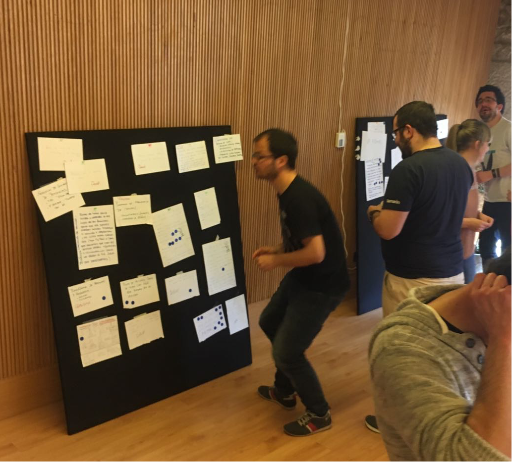

#Hackathon for refugees, second edition

During two days, people with different backgrounds will be working on several own open source projects and ideas to help refugees in any imaginable way.
After explaining and voting many of their own proposed ideas, the following ones were selected and teams built to work on them:

##[Integrapp](https://github.com/refu-gal/integrapp) - [web](http://meanit.refu.gal)

Web platform offering goods and services for refugees to opt in when the get to some new place (i.e. somewhere to sleep, food, children caring, ...)

##[Morewithless](https://github.com/refu-gal/morewithless) - [web](http://morewithless.refu.gal)

Movement to get companies to provide a checkbox on their employees' contracts so they can donate part of their annual wages to some NGO. Also provides a platform to follow up on actions being done with that money.

##[Refubot](https://github.com/refu-gal/refubot) - [web](http://refubot.refu.gal)

Refugee oriented bot to achieve an improvement on communication with other refugees and different organizations working with them. You could, for example, send an alert to the bot about some danger and it can then notify other nearby refugees about it.

##[Geohelp](https://github.com/refu-gal/geohelp) - [web](http://geohelp.refu.gal)

Involve local people to lend some not used crop fields so refugees or other people in needs could work those fields for free and get food and basics for them and their families.

##[Social Arcade]()

A crowdfunding campaign to fund the building of three arcade social machines, an arcade machine whose proceeds will go to help refugees and organizations involved in helping refugees.

#Some other ideas proposed

These other ideas proposed, were not developed, but could be equally valuable

* Local platform helping refugees with their integration.
* Mentor network / Time based currency network to help local refugees.
* Platform incorporating prototypes that could be built with waste materials.
* Recommendation platform where people can rate refugees' profiles.
* Webcam network in the exit route for refugees.
* Public/private database where people in refugee camps can publish their data in order to get reached.
* Question/Answer platform.
* Hub to host all the initiatives of the different NGOs.
* Meetup groups to connect refugees and volunteers.
* Photo gallery with photos from the conflict zones to attract people attention to the problem.
* Platform to offer different services for refugees.
* Elearning platform with videos made by refugees to refugees.
* Public FAQ in different languages oriented to make easier the cultural adaptation.
* Platform to track campaings.
* Crowfunding platform for social campaings.
* Platform to teach the local languages to refugees.
* People localization service.

